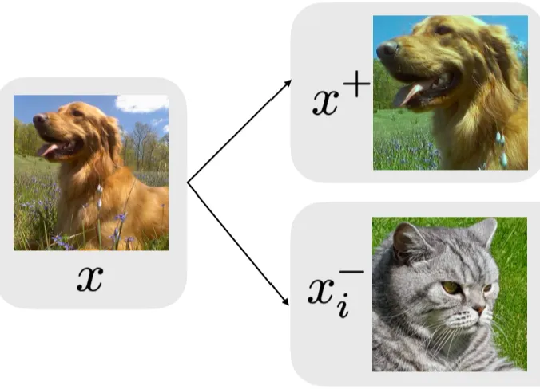
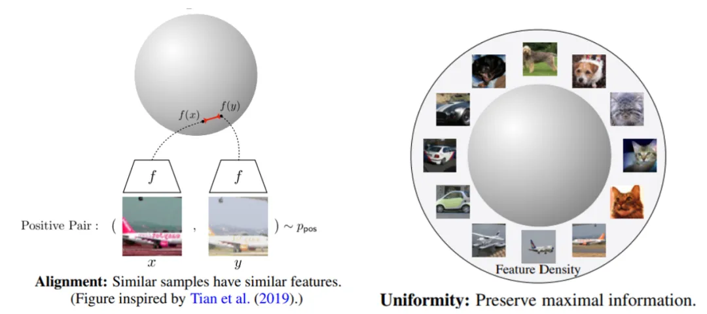
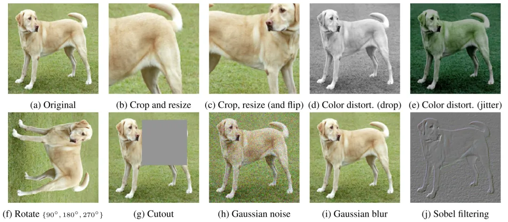

### 对比学习

总的来说是为了训练一个更好的特征表示（Encoder）

以图像为例，对比学习期望通过使同一类狗不同角度照片的表示相近，而不同种类动物对应的表示距离相远，使得学到的表示可以忽略掉角度（或光影等）变换带来的细节变动，进而学习到更高维度、更本质的特征（语义）信息。

这里我们引入两个重要的概念，对齐性(alignment)和均匀性(uniformity)。由于对比学习的表示一般都会正则化，因而会集中在一个超球面上。对齐性和均匀性指的是好的表示空间应该满足两个条件：一个是相近样例的表示尽量接近，即对齐性；而不相近样例的表示应该均匀的分布在超球面上，即均匀性。满足这样条件的表示空间是线性可分的，即一个线性分类器就足以用来分类，因而也是我们希望得到的，我们可以通过这两个特性来分析表示空间的好坏。

#### 正负样例

如上所述，正样例指的是与给定样例语义相近的样例，而负样例指的是与给定样例语义不相近的样例。对于有监督的数据，正负样例很容易构造，同一标签下的例子互为正样例，不同标签下的例子互为负样例，但对于无标签的数据，我们如何得到正负样例呢？

目前的主流做法是对所有样例增加扰动，产生一些新的样例，同一个样例扰动产生的所有样例之间互为正样例，不同样例扰动产生的样例彼此之间互为负样例。现在的问题就变成了如何可以在保留原样例语义不变的情况下增加扰动，构造新样例。

图像领域中的扰动大致可分为两类：空间/几何扰动和外观/色彩扰动。空间/几何扰动的方式包括但不限于图片翻转（flip）、图片旋转（rotation）、图片挖剪（cutout）、图片剪切并放大（crop and resize）。外观扰动包括但不限于色彩失真、加高斯噪声等。

### 损失

原始对比损失

给定一个样例对 $(x_1, x_2)$，我们有标签 $y \in \{0,1\}$， $y = 1$ 代表样例对互为正例， $y = 0$ 代表样例对互为负例。进而定义了对比损失：

$$
L(( (x_1, x_2), y) = yL_p \left( D(f_\theta(x_1), f_\theta(x_2)) \right) + (1-y)L_n \left( D(f_\theta(x_1), f_\theta(x_2)) \right)
$$
其中，$D(\cdot, \cdot)$ 为距离度量函数，$L_p(\cdot)$ 为一递增函数，$L_n(\cdot)$ 为一递减函数。当互为正例时，距离越远损失越高；互为负例时，距离越近损失越高。

infoNCE loss

而InfoNCE，又称global NCE，在文献"Representation Learning with Contrastive Predictive Coding"中提出。InfoNCE继承了NCE的基本思想，从一个新的分布引入负样例，构造了一个新的多元分类问题，并且证明了减小这个损失函数相当于增加互信息(mutual information)的下界。

$$
L_q(u, v^+, \{v^-\}) = -\log \frac{\exp(u \cdot v^+ / \tau)}{\sum_{v \in \{v^+, v^-\}} \exp(u \cdot v / \tau)}
$$

其中 $u, v^+, v^-$ 分别为原样例、正样例、负样例归一化后的表示，$\tau$ 为温度超参数。显而易见，infoNCE最后的形式就是多元分类任务常见的交熵（cross entropy）softmax 损失。因为表示已经归一化，據前所述，向量内积等价于向量间的距离度量。故由softmax的性质，上述损失就可以理解为，我们希望在拉近原样例与正样例距离的同时，拉远其与负样例间的距离，这正是对比学习的思想。温度超参是softmax中常见的超参，$\tau$ 越小，softmax越接近真实的max函数，$\tau$ 越大越接近一个均匀分布。因此，当$\tau$ 很小时，只有难区分的负样例才会对损失函数数产生影响，同时，对错分的样例（即与原样例距离比正样例与原样例距离近）有更大的惩罚。实验结果表明，对比学习对$\tau$ 很敏感。下文对比损失若不特意提及，则默认认为infoNCE loss。

在 InfoNCE（信息噪声对比估计）损失计算过程中，如何选择正样本对和负样本对。具体过程如下：

### 正样本对

在每次迭代 $t$ 时，给定一个随机采样的批次 $D_t = \{x_i \sim p(\mathbf{x})\}_{i=1}^b$ 包含 $b$ 个数据点，相应的多视图批次 $\tilde{D}_t = \{x_i\}_{i=1}^{2b}$ 包含 $2b$ 个数据点，其中 $\mathbf{x}_{2i-1}$ 和 $\mathbf{x}_{2i}$ 是通过随机增强得到的 $x_i \in D_t$ 的两个视图（Chen et al., 2020d; Tian et al., 2020）。

在这个多视图批次中，考虑任意增强的数据点 $x_i$ 和对应的来自同一源样本的增强数据点 $x_{a(i)}$，我们将 $x_i$ 和 $x_{a(i)}$ 作为正样本对。在这个上下文中，$\mathbf{x}_i$ 通常被称为锚点（anchor），$\mathbf{x}_{a(i)}$ 被称为正样本（positive）。

### 负样本对

除了正样本对之外，其他所有的样本都被认为是负样本。在多视图批次 $\tilde{D}_t$ 中，除了 $\mathbf{x}_{a(i)}$ 之外的其他 $2(b-1)$ 个样本都被视为负样本。

### 具体损失计算

InfoNCE 损失的具体形式如下：

$$ \mathcal{L}_{\text{InfoNCE}} = \sum_{i \in \mathcal{I}} \ell_{\text{InfoNCE}}^{(i)} = \sum_{i \in \mathcal{I}} - \log \frac{\exp(\mathbf{z}_i \cdot \mathbf{z}_{a(i)} / \tau)}{\sum_{k \in \mathcal{I} \setminus \{i\}} \exp(\mathbf{z}_i \cdot \mathbf{z}_k / \tau)} $$

在这个公式中：

- $\mathbf{z}_i$ 是样本 $x_i$ 的嵌入表示。
- $\mathbf{z}_{a(i)}$ 是与 $x_i$ 相对应的正样本的嵌入表示。
- $\mathbf{z}_k$ 是批次中所有样本（包括正样本和负样本）的嵌入表示。
- $\tau$ 是温度参数，控制对比损失的刻度。

简而言之，在InfoNCE中，正样本对由两个来源于同一原始样本并通过不同数据增强方法生成的样本组成，而负样本对则由批次中所有其他样本组成。InfoNCE的损失函数通过最大化正样本对的相似度，同时最小化负样本对的相似度，来训练模型的嵌入表示。

### PU中的NCE Loss

1. **无标签锚点作为正样本**：
   - 如果无标签锚点$\mathbf{x}_i$被视为正样本（即$\mathbf{y} = +1$），则所有的标记样本以及与$\mathbf{x}_i$的增广样本$\mathbf{x}_{a(i)}$一起被用作正样本对。
2. **无标签锚点作为负样本**：
   - 如果无标签锚点$\mathbf{x}_i$被视为负样本（即$\mathbf{y} = -1$），由于没有可用的标记负样本，puNCE仅将$\mathbf{x}_{a(i)}$（与$\mathbf{x}_i$自身的增广样本）作为正样本对，其他样本均作为负样本对。

3. **标记锚点的正对**：

   - 对于每个标记锚点 $\mathbf{x}_i$，通过数据增强生成的视图 $\mathbf{x}_{a(i)}$ 作为正样本。具体地说，$\mathbf{x}_i$ 和 $\mathbf{x}_{a(i)}$ 构成一个正样本对。

   - 此外，标记批次中的所有其他标记样本也是 $\mathbf{x}_i$ 的正样本，因为它们都来自相同的标记类。

4. **标记锚点的负对**：
   - 对于每个标记锚点 $\mathbf{x}_i$，除了正样本对之外，批次中的所有其他样本（包括无标签样本和其他增强视图）都被视为负样本。

