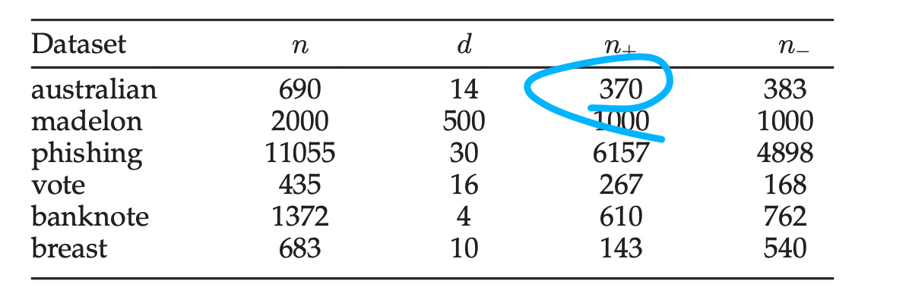
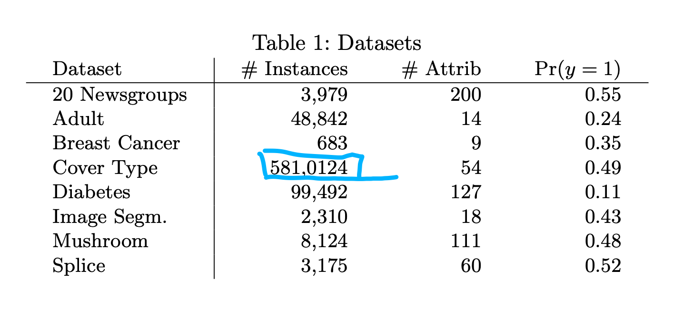

# UCI二分类数据集整理

## 整理的文章中所使用的二分类数据集

- Instance-Dependent Positive and Unlabeled Learning With Labeling Bias Estimatio(LBE-LF)
  - australian
  - madelon
  - phishing
  - vote
  - banknote
  - breast
- Beyond the Selected Completely At Random Assumption for Learning from Positive and Unlabeled Data(SAR-EM)
  - 20 Newsgroups
  - Adult
  - Breast Cancer
  - Cover Type
  - Diabetes
  - Image Segmentation
  - Mushroom
- Learning From Positive and Unlabeled Data with A Selection Bias[PUSB]
  - mushrooms
  - shuttle
  - pageblocks
  - usps
  - connect-4
  - spambase
- Recovering the Propensity Score from Biased Positive Unlabeled Data[LC]
  - yeast
  - bank
  - wine
  - HTRU 2
  - Occupancy
  - Adults
- Deep Generative Positive-Unlabeled Learning under Selection Bias[VAE-PU]
  - 20 Newsgroups
-  Bagging Propensity Weighting: A Robust method for biased PU Learning[BWP]
  - Breastcancer
  - Image Segment
  - Mushroom
  - Splice
  - 20 Newsgroups
- PUe biased positive-unlabeled learning enhancement by causal inference[PUE]
  - None

## 汇总的UCI二分类数据集及数据集详情

### Australian

https://archive.ics.uci.edu/dataset/143/statlog+australian+credit+approval

ID:143

Feature: 14 

Instances: 690

### Madelon

https://archive.ics.uci.edu/dataset/171/madelon

ID:171

Feature: 500

Instances: 4400,Training set 2000 (LBE中仅用了这2000条)

### Phishing

https://archive.ics.uci.edu/dataset/327/phishing+websites

ID:327

Feature:30

Instances:11055

### Congressional Voting Records

https://archive.ics.uci.edu/dataset/105/congressional+voting+records

ID: 105

Feature: 16

Instances: 435

### banknote

https://archive.ics.uci.edu/dataset/267/banknote+authentication

ID:267

Feature: 4

Instances: 1372

### breast

https://archive.ics.uci.edu/dataset/15/breast+cancer+wisconsin+originalI

ID:15

Feature:9

Instances:699(去掉缺失值后为683)

### 20 Newsgroups

https://archive.ics.uci.edu/dataset/113/twenty+newsgroups

ID:113

Feature:200

Instances:3979

### Adult

https://archive.ics.uci.edu/dataset/2/adult

ID:2

Feature: 14

Instances: 48842

### covertype

https://archive.ics.uci.edu/dataset/31/covertype

ID:31

Feature: 54

Instances: 581012

### Diabetes

 :wrench:

### Image Segmentation

https://archive.ics.uci.edu/dataset/50/image+segmentation

ID: 50

Feature:19

Instances:2310

### mushroom

https://archive.ics.uci.edu/dataset/73/mushroom

ID: 73

Feature: 22

Instances : 8124

### shuttle

https://archive.ics.uci.edu/dataset/148/statlog+shuttle

ID: 148

Feature: 7

Instances:58000

### page blocks 

https://archive.ics.uci.edu/dataset/78/page+blocks+classification

ID: 78

Features: 10

Instances: 5473

### connect-4 

https://archive.ics.uci.edu/dataset/26/connect+4

ID:26

Instances: 67557

Features: 42

### spambase

https://archive.ics.uci.edu/dataset/94/spambase

ID:94

Instances: 4601

Features: 57

### yeast 

https://archive.ics.uci.edu/dataset/110/yeast

ID:110

Instances:1484

Features:8 

### wine

https://archive.ics.uci.edu/dataset/109/wine

ID: 109

Instances: 178

Features:13

### HTRU-2 

https://archive.ics.uci.edu/dataset/372/htru2

ID:372

Instances:17898

Features:8

### Occupancy Detection

https://archive.ics.uci.edu/dataset/357/occupancy+detection

ID:357

Features: 6

Instances: 20560

